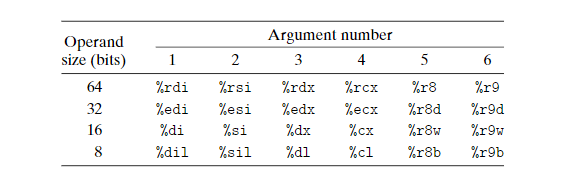
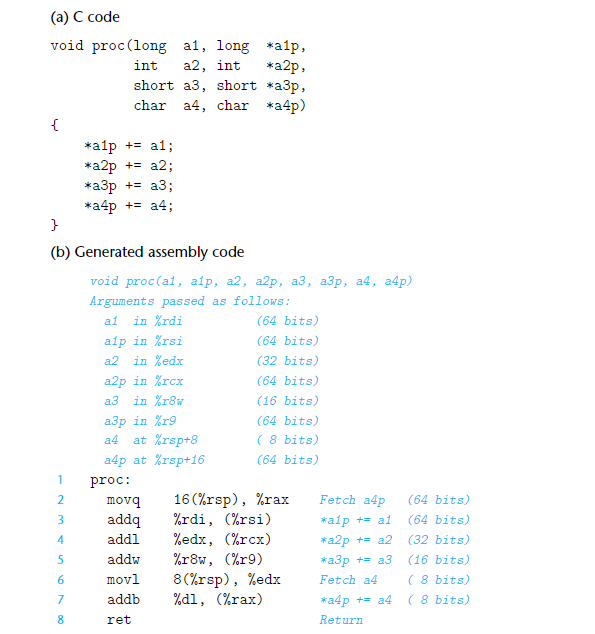
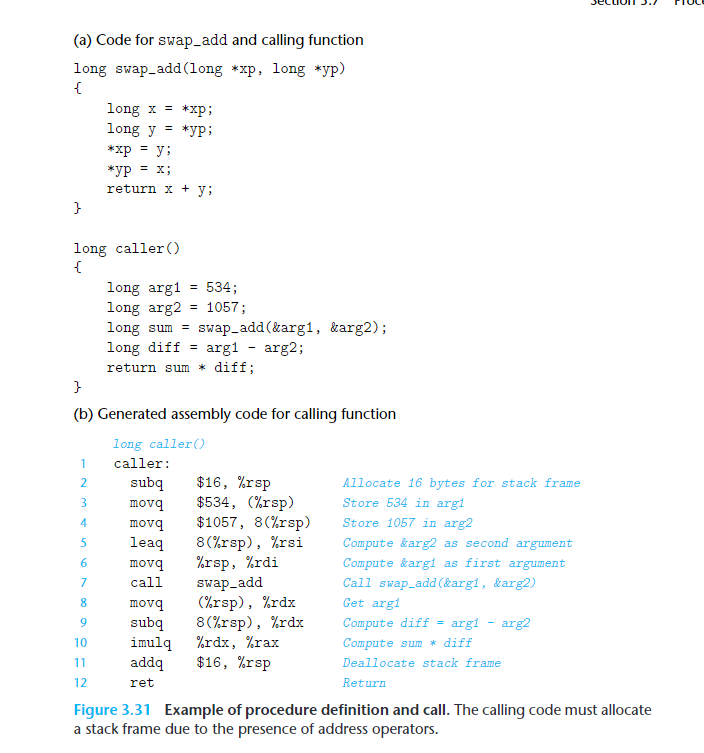
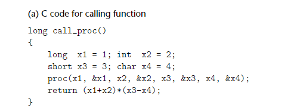
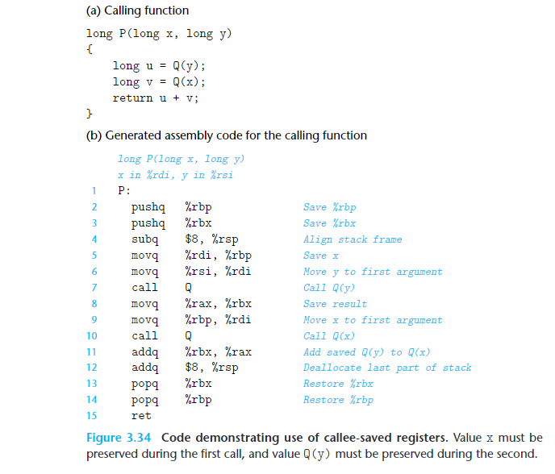

CSAPP第二章

# 目录

* 1. [寄存器分类](#register)
* 2. [Stack](#Stack)
* 3. [Control Transfer](#ControlTransfer)
* 4. [Data Transfer（arguments）](#DataTransferarguments)
* 5. [Local Storage on Stack（Local variables）](#LocalStorageonStackLocalvariables)
* 6. [Local Storage in Registers（Saved registers部分）](#LocalStorageinRegistersSavedregisters)

# procedure

##  1. 寄存器分类

 %rbx,%rbp, %r12–%r15 are classified as **callee-saved registers**

%rdi  %rsi  %rdx  %rcx   %r8 %r9   **caller-saved registers**

%rsp  %rbp栈指针：%rbp% 指向栈底， %rsp指向栈顶来，限制栈帧的范围

%rax 保存function 的返回结果

%rip 下一条将要被执行的指令的逻辑地址

##  2. Stack

         

例如p(int.....,int 7x,int 8x,int 9x)->先9x进栈在8x进栈,从后往前

##  3. Control Transfer

call：被调用方法返回后的下一条指令地址（return address）push 到stack，然后pc设置为被调用方法的首地址

ret：pop出return address，然后pc设置为return address

##  4. Data Transfer（arguments）

假设p调用proc，p栈帧里传给proc的参数，超过6个的，存储在stack里面，并且最后 a4p 先压入栈，再a4，每个参数要对齐，所以下面实际是p的栈帧结构。

##  5. Local Storage on Stack（Local variables）

局部变量存在stack的例子，局部变量也是按倒序来存的

结合data transfer和local storage例子

为local variable设置栈帧，参数和加载方法的参数到register

上图表示local variables x1-x4在 stack 的分配，**变量在stack不用对齐**； parameters x1-x4和&x1-&x4 6个分配在register，2个分配在stack,**参数在stack要对齐**

##  6. Local Storage in Registers（Saved registers部分）

（使用**callee-saved registers**来保存变量，必须在callee()里面保存之前caller()的寄存器数据到stack，再使用，callee()执行完返回后，把stack的变量写回到寄存器，交给caller()继续执行)

The name“caller saved”: can be understood in the context of a procedure P having some local data in such a register and calling procedure Q. Since Q is free to alter this register,it is incumbent upon P(the caller) to first save the data before it makes the call.

## 总结

栈帧压栈的顺序是

先看有没有需要保存的被调用者寄存器，有的话压栈，（callee-register）

随后看有没有多余的不满足条件的局部变量，有的话压栈，（Local variables，寄存器用完了存stack）

随后看有没有满足条件的局部变量，有的话压栈，（Local variables，指针，数组存stack）

随后看有没有多余的需要构造的参数，有的话压栈，（arguments大于6个存stack）

随后用call来调用函数并保存返回地址，函数返回后继续运行

运行到最后时，若之前有需要保存的被调用者寄存器，则把值从栈中弹回到对应的寄存器。
